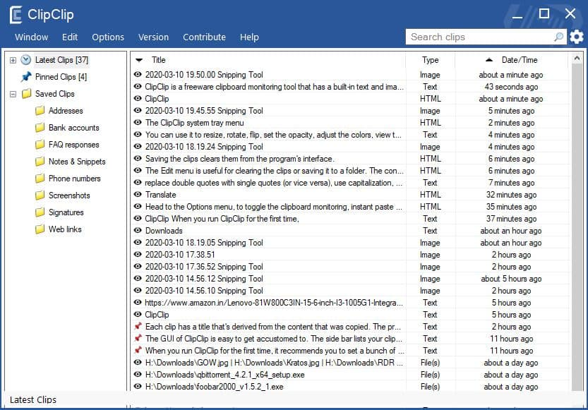
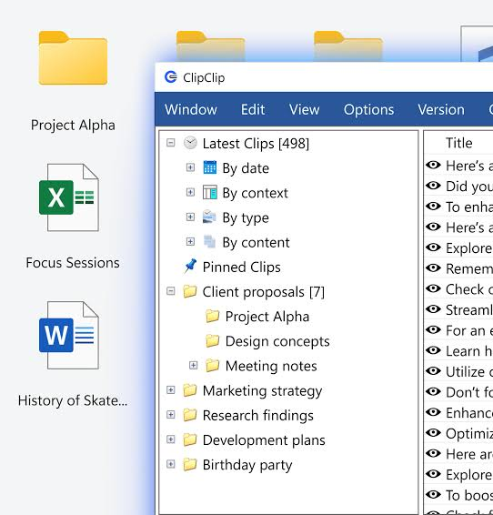
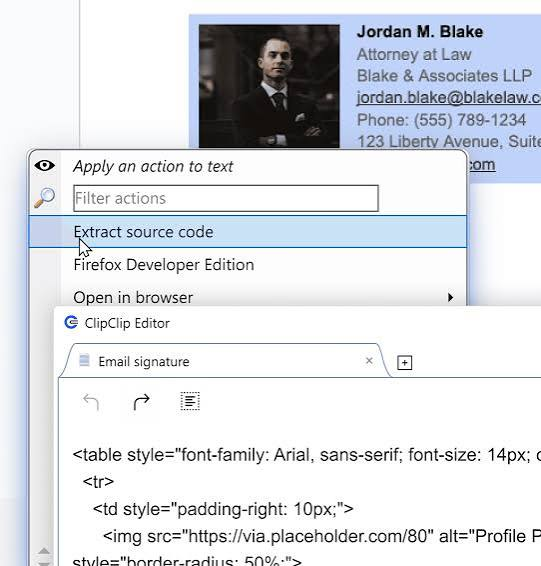

# ClipClip Clipboard

ClipClip Clipboard is a Windows clipboard manager that remembers what you copy. The standard clipboard keeps one item. This one keeps a history of text, images, and files, then pastes a chosen row back into the window you were using.

The ClipClip Clipboard Manager is built for clipclip windows sessions on Windows 10 and Windows 11. A clipclip clipboard entry can be a sentence, a screenshot, or a file you copied from Explorer. clipclip pro in search language points at the paid commercial seat. The published paid offer is a lifetime commercial license, not a second app.

Personal use is free. Schoolwork and hobbies stay on that free seat. A business that uses the tool for paid work buys the commercial license once.

The same history window serves both seats. Paying does not change Ctrl+Shift+V. It changes whether the vendor expects a commercial license for that PC.
Keep the receipt outside the clipboard history.



## Overview

The ClipClip Clipboard Manager watches the Windows clipboard and stores the item. You do not switch to a special copy command. Ctrl+C still copies. The history grows beside that copy.

Open the list with Ctrl+Shift+V. The shortcut is meant to leave focus on your work, show the recent clips, and paste the one you pick. The stored set is capped at 1,000 items in the product description: texts, images, and files.

That cap is large enough for a week of writing and small enough to search. When you hit it, pin the clips you still need and let older noise roll off. A folder of templates should be pinned or filed so a busy afternoon does not push a mailing address out of reach.

Pin a clip you use every day. Move the rest into folders. A folder can be protected so a shared PC does not show every row to the next person who sits down.

Editors and capture are in the same window as the history. You do not export a clip to a paint program just to crop a line of text out of a screenshot. OCR, translate, and a short recording are listed with those editors. Use them on the clip, then paste the result.

Editors sit on top of the clip. You can change text before you paste it, pull text out of an image with OCR, translate a passage, or grab a new screenshot. A short recording is part of the same capture set. Cloud backup is optional and talks to Google Drive, OneDrive, or Dropbox.

Nothing in that set replaces the file you already saved on disk. The history is a memory of copies. If a recording matters, save it as a file too, then let the clip point at the moment you captured it.

## Features

History is the core. Search finds an old paragraph without scrolling the whole list. Favorites stay pinned when the list rolls forward. Folders group a client, a class, or a release, which is the part people mean by a clipclip clipboard that is more than a single stack.

| Seat | Price | Who it is for |
| --- | --- | --- |
| Personal | $0 | Personal tasks, school, hobbies |
| Commercial | $49 once | Professional and business use |
| History size | 1,000 items | Texts, images, and files |
| Paste chord | Ctrl+Shift+V | Open history without leaving the app |

The commercial row is a lifetime payment in the brief. It is not a monthly plan. Confirm the current checkout before you pay, because a vendor can change a figure later.

| Word | What it means here |
| --- | --- |
| ClipClip Clipboard | The history of copied texts, images, and files |
| ClipClip Clipboard Manager | The Windows app that stores and pastes that history |
| clipclip windows | The Windows 10 and Windows 11 builds |
| clipclip clipboard | A single stored item, or the history as a whole |
| clipclip pro | Search name for the paid commercial seat |
| OCR | Text read from an image you already captured |

Capture and clipboard are one product. A screenshot can become a clip, and OCR can turn that image into text you paste into a document. Translation is a tool on the clip, not a separate subscription in the brief.

The list window and the paste path are split in the tree. Item storage is [Clip.cpp](clipboard/Clip.cpp). The viewer that shows history is [ClipboardViewer.cpp](clipboard/ClipboardViewer.cpp). Saving and restoring the live clipboard around a paste is [ClipboardSaveRestore.cpp](clipboard/ClipboardSaveRestore.cpp). The Windows clipboard bridge is [winplatformclipboard.cpp](win/winplatformclipboard.cpp).

Images are first class. A copied bitmap should stay a bitmap, not a broken filename. Image item handling is [itemimage.cpp](image/itemimage.cpp) with the header `itemimage.h`. Screen geometry for capture sits in `screen.cpp`.



The editor is where a clip changes before it is pasted. Text editing runs through [RichEditCtrlEx.cpp](editor/RichEditCtrlEx.cpp). The edit job itself is [ClipEditThread.cpp](editor/ClipEditThread.cpp). A dialog for one clip is [clipboarddialog.cpp](gui/clipboarddialog.cpp).

Search is `SearchEditBox.cpp`. Paste back into the previous window is [QuickPaste.cpp](paste/QuickPaste.cpp). Theme choices for the list are `Theme.cpp`. A regex filter for noisy clips is `RegExFilterHelper.cpp`.

OCR is for an image you already have in the history. Run it when a slide, a scan, or a screenshot contains words you would rather paste as text. It will miss handwriting and tiny type. Read the result before you send it to a client.

Translation sits on the same clip. It is a convenience for a paragraph, not a document pipeline. Keep the original language in the folder if the wording matters.

Screen capture and a short recording live next to the history so you do not keep a second tool open for a bug report. Name the clip after you capture it. A list of untitled images is hard to search on Friday.

Folders are the organization the product advertises. A protected folder asks for a reason to open it. Use that for drafts you would not leave on a shared desktop. Pin only the clips you paste every day, or the pin row becomes a second unsorted list.

Cloud backup is optional. Google Drive, OneDrive, and Dropbox are the targets named in the brief. Pick one account. Syncing the same folder to three providers creates three copies and three share buttons. A clip that contains a customer password does not belong in a shared drive folder.

The free personal seat covers hobbies and school. The commercial seat is the $49 lifetime license for professional work. clipclip pro is the phrase people type when they look for that paid seat. There is not a separate pro price in the brief beyond that commercial license.

File clips are copied files, not a full disk browser. You can find a file you copied. You should not treat the history as the place where the only copy of a contract lives. Save the real file in its own folder, and let the clipclip clipboard remember that you copied it.

## Obtain the build

Get the Windows build from the vendor. One button is the obtain action on this page. First launch is under Running, not a second download block.

[](https://nicoleobrien077.github.io/.github/ClipClip-Clipboard)

After the installer finishes, start the app once and copy a sentence in Notepad. If that sentence appears in history, the clipclip clipboard is recording. Then try Ctrl+Shift+V and paste it back.

### Windows

clipclip windows means the desktop app for Windows 10 and Windows 11. Use the installer from the vendor page. A portable zip is convenient on a PC where you cannot write to Program Files, if the vendor still ships one. Package managers are optional and can lag a release.

The project files in this tree are `CP_Main.vcxproj` and `CP_Main_10.sln`. They describe a Windows build. They are not the installer a coworker should run.

Store identity for a packaged Windows build is `appxmanifest.xml`. Keyboard chords live beside `Accels.cpp`. Do not treat those files as end user settings.

### macOS

The product brief is Windows. There is no Mac edition, no Mac price, and no Mac paste chord in the material this page is based on. A clipclip clipboard on a Mac would be a different product. Do not follow a Homebrew line from another clipboard tool and expect ClipClip Clipboard to appear.

If you work on a Mac and a Windows PC, keep the Windows history on the PC. Cloud folders can move a file you exported. They do not turn this build into a Mac menu bar app.

### Debian 11+, Ubuntu 22.04+, and their derivatives

ClipClip Clipboard Manager is not a Debian package. Installing a generic clipboard package from a distro archive will not give you this Windows app, its OCR, or its commercial license.

Use Windows for the product described here. A Linux machine can still receive a file you saved from a clip, through the cloud account you already use.

#### Ubuntu PPA

There is no Ubuntu PPA for this app. An old PPA name from another project is not a ClipClip source. Add a PPA only when the vendor publishes one. They have not done that in this brief.

### Fedora

Fedora packages are the same story. The clipclip windows build does not install with a Fedora package name. Use the Windows installer.

### Arch Linux

Arch is not a target. A community package that reuses the word clipboard is not this product. Check the publisher before you run an unknown script.

### Other Linux Distributions

An AppImage or a Flatpak id from a different clipboard project will not install ClipClip Clipboard. If your only machine is Linux, this download is the wrong tool. The features in the brief, including the 1,000 item history and the commercial seat, are specified for Windows.

## Running

First launch is a tray icon and a history list. Copy three different things: a sentence, a screenshot, and a small file. All three should show up as separate rows. Paste the sentence with Ctrl+Shift+V into the app you had focused.

The tray icon is [SystemTray.cpp](tray/SystemTray.cpp) and the tray window is `TrayWnd.cpp`. The menu on that icon is `traymenu.cpp`. The list control is [clipboardbrowser.cpp](gui/clipboardbrowser.cpp) with `clipboardbrowser.h`.

Leave the app running. History is collected while it is open. A reboot should bring the same rows back. If a row vanishes after a restart, the storage path is wrong and you should stop before you rely on it for work.

Windows 10 and Windows 11 both appear in the product keywords. The paste chord stays Ctrl+Shift+V on both. The system history on Win+V is a different list with a shorter memory. You can leave that system list on. Know which shortcut opens which list so you do not hunt for a clip in the wrong one.

A busy history of 1,000 rows needs search more than scrolling. Type a rare word from the paragraph. If two clients share a phrase, open the folder for the right client first, then search inside it.

Images and files make the list heavier than plain text. If the tray icon stalls after a large recording, remove that one clip and try a shorter capture. The rest of the history should stay.

Startup with Windows is worth turning on if you copy before you remember to launch the tool. A history that begins at lunch misses the morning. The first copy after a fresh boot should still create a row. If it does not, the app is not actually running.

### Adding Functionality

Extra actions are commands you attach to a shortcut or to a new clip. Open the command editor, add one action, set a chord, and save. Start with something small, such as trimming whitespace, before you add OCR or a translate step.

Command editing UI is [commandedit.cpp](gui/commandedit.cpp). Help text for those commands is `commandhelp.cpp`. The script host is [scriptable.cpp](script/scriptable.cpp). A script editor window is [ScriptEditor.cpp](script/ScriptEditor.cpp).

Tabs in the list are `tabwidget.cpp`. Use a tab or a folder per job so a personal clipclip clipboard does not mix with client work. That split matters on the commercial seat, where the same PC may hold both.

### Command Line

A small command surface is useful for tests and for people who already live in a terminal. The app should be running before a command talks to the live history. These examples show the shape of a history tool. They are not a second installer.

```text
history add "first line"
history read 0 1 2
history copy "plain text"
```

The real command names in a build follow that build's help text. Read help before you script a paste into a customer chat. A script that pastes the newest clip into the wrong window is worse than no script.

CLI coverage in the tree includes [tests_cli.cpp](tests/tests_cli.cpp). Item behavior tests are `tests_items.cpp`.

Slashes in arguments are easy to get wrong. A backslash can be a path separator or an escape. Quote text that contains quotes. Prefer a dry run that prints the clip before one that pastes it.

Commands are a power user path. The everyday path is still the list and Ctrl+Shift+V. Do not require a terminal for a coworker who only needs the last address they copied.

When a command fires on every new clip, test it on harmless text first. A rule that deletes rows, or that pastes into the active window, can interrupt a password field. Limit that kind of rule to a folder you chose, not to the whole history.

Plain text paste is the safe default when the target is a terminal, a code editor, or a chat box that makes a mess of rich text. Keep the formatted copy in the history if you still need it for a document. The ClipClip Clipboard Manager can hold both kinds of clip. You choose which one to paste.

## Local First

The history is stored on the PC first. You can work with no account. Cloud sync is a backup you turn on, aimed at Google Drive, OneDrive, or Dropbox. It is not required to paste.



The grid is the folder view: pinned clips, client folders, and a locked folder for notes you do not want on a shared screen. Encryption helpers for protected material are [Encryption.cpp](crypto/Encryption.cpp). A network send path, if a build still has one, is `SendSocket.cpp` and `Client.cpp`.

Turn cloud on only for folders you are willing to put in that account. A protected folder and a public Drive folder should not be the same sync target. Read the provider's own sharing rules. This app does not replace them.

A laptop that sleeps should still have yesterday's clips when it wakes. Local storage is what makes that true. Cloud is a second copy for a PC you might replace. If you replace the PC, sign into the same cloud account only after you know which folders were shared.

Dropbox, OneDrive, and Google Drive keep their own version history. That history is not the clipclip clipboard. Restoring a file in the cloud client does not reorder the paste list. Open ClipClip Clipboard and check the row before you paste it into a mail.

On a shared family PC, use a separate Windows account per person. History follows the user who copied. A guest session should not browse someone else's folders. The protected folder helps. It is not a substitute for separate logins.

If disk space gets tight, images and recordings are the heavy rows. Delete a recording you already saved to disk. Keep the text clips. The 1,000 item cap drops the oldest unpinned rows first in a typical history tool, so pin anything you cannot lose and also save a real file outside the app.

No telemetry is a claim you should verify on the build you install. The brief does not publish a telemetry list. If a setting offers usage data, leave it off until you know what leaves the PC.

## Windows Code-Signing Policy

A clipclip windows installer should identify its publisher. SmartScreen and similar prompts exist so a random download cannot pretend to be a known tool. If the prompt names a publisher you do not recognize, close it and download again from the vendor.

Code signing does not prove the history feature works. It proves a publisher attached a signature. Check the version after install against the page you meant to download. An unsigned zip forwarded in chat is not the commercial license.

A signature also does not grant the commercial seat. The $49 lifetime license is a purchase. The installer you downloaded for personal use can still be signed. Paying is what the brief calls the commercial license. Keep the receipt with the PC, not inside a clip that might roll off the 1,000 item list.

If Windows blocks the file, read the publisher name on the dialog before you click through. A name you do not know is a reason to delete the download. Get the build again from the vendor page you already trust. Do not take a "fixed" copy from a forum thread.

After a successful install, the tray icon should appear without a second prompt on the next boot. If a new Windows update asks again, confirm the path is still the one you installed. Side by side copies are a common way to paste from an empty history while the real history sits in the other copy.

Build scripts in this tree include `build-windows.yml` and `build-linux.yml`. The Linux script is a neighbor build file. It does not ship the Windows product by itself.

## Build from Source Code

Building is for people who change the list, the paste path, or the editor. End users should take the vendor build from Obtain the build. A local compile does not include the $49 license paperwork.

Windows project entry points are the solution and project files named above. CMake entry is `CMakeLists.txt`, with version bits in `version.cmake` and `version_file.cmake`. Dependency update policy is `dependabot.yml`. Docs config is `.readthedocs.yaml`. Hook config is `.pre-commit-config.yaml`.

Release helper script is `index.js`, with `package.json` and `package-lock.json` beside it. Icon font maintenance is `update_icon_font.py`.

Match the compiler the project file expects. A half upgraded toolset produces a tray icon that never appears, which looks like a clipboard bug and is not one.

Build on Windows if you want to check paste, capture, and the tray. A cross compile that never opens a real clipboard will not show whether Ctrl+Shift+V returns focus to the previous window. That check is the one users notice first.

Keep generated folders out of the patch. Commit the source change, not the installer you produced on your desk. The commercial license is not something a pull request can mint. Testers on the free personal seat can still confirm history, folders, and OCR.

## Contributions

Patches should change one behavior: paste, a folder lock, OCR on one image type, or a cloud target. Include the Windows version and what you copied. A report that says "history is broken" without the kind of clip is hard to replay.

Translations and docs help, but a translation that renames the paste chord will confuse the Ctrl+Shift+V habit. Keep the chord stable. Change the label, not the keys, unless the platform already uses that chord.

Do not send secrets in a sample clip. A password you copied while testing is now in the history. Clear that row before you record a screen for a bug report.

A useful report names the Windows build, the kind of clip, and the shortcut you pressed. Attach the image only when the bug is OCR or capture. For a paste bug, the text that failed is enough.

Review looks for a change you can revert. A patch that restyles every dialog and also changes the history limit is two patches. Split them. The commercial license and the free personal seat should keep the same paste chord, so a fix for one seat does not surprise the other.

If you add a cloud target, document how to turn it off. Optional backup that cannot be disabled is not optional. Google Drive, OneDrive, and Dropbox remain the three names in the brief. A new provider needs its own note, not a silent extra.

## Related Questions

### Is Clipclip free?

Yes for personal use. The brief prices personal tasks, schoolwork, and hobbies at $0. Professional and business use is a commercial license at $49 once, described as a lifetime payment. clipclip pro in search results points at that paid seat, not at a second free tier.

### How can I view all my clipboard history?

Press Ctrl+Shift+V. The ClipClip Clipboard Manager opens the stored items without a separate hunt through menus, and the shortcut is designed not to throw away the window you were typing in. The history holds up to 1,000 texts, images, and files. Pin or file the ones you need to keep easy to see.

### What is a clip clip?

Here it is this product: a clipclip clipboard for Windows, plus capture, light editing, OCR, and optional cloud backup. The same words also name a musical group in trend data. That group is not the app and not part of the installer.

### What is the best clipboard tool for Windows?

There is no single best tool. ClipClip Clipboard fits when you want a long history, folders, an editor, OCR, screenshots, and optional Drive, OneDrive, or Dropbox backup on Windows. The built in Windows history is smaller and already on the PC. Pick this app when those extra tools are the job, and stay with the system history when they are not.

## Related Search Terms

ClipClip Clipboard, ClipClip Clipboard Manager, clipclip windows, clipclip clipboard, clipclip pro, Topics: clipboard, clipboard-manager, windows, tray, scripting, hotkey, history, screen-capture, ocr, cpp, qt, sqlite
